# Implementation Plan - Women Safety Application Enhancements

This document outlines the changes implemented in the **Women Safety Application** codebase to address package dependency errors, replace OTP verification, integrate Leaflet interactive maps, set up Firebase backend services, and implement a mesh network propagation visualizer.

## Feature and Functionality Diagrams

### 1. Overall System Architecture & Data Storage
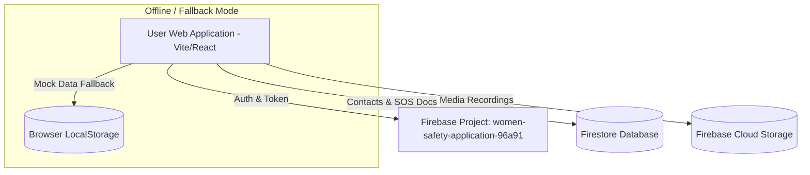

### 2. User Onboarding & Instant Authentication Flow
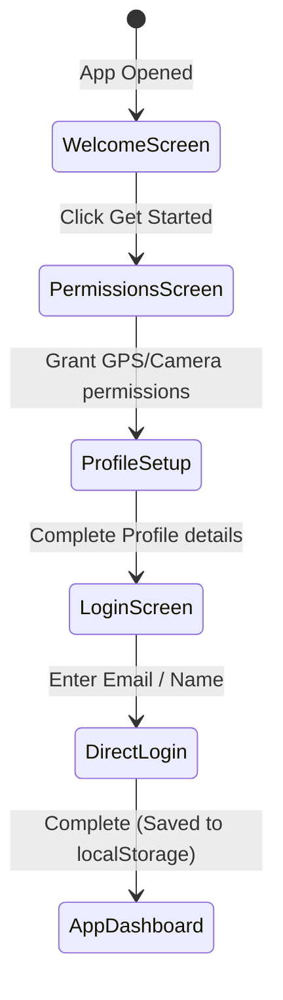

### 3. Safe Route Planning & Navigation Flow
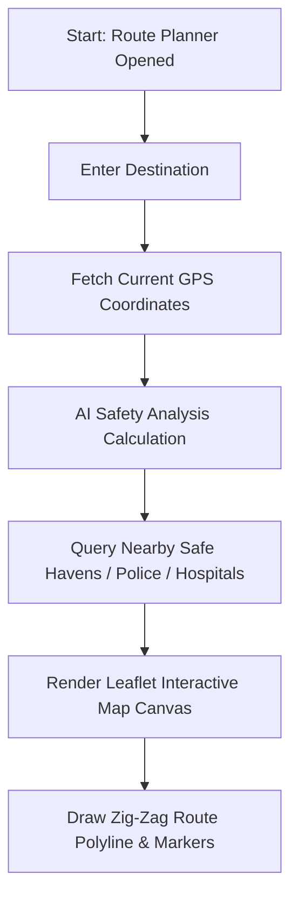

### 4. SOS Emergency Trigger & Evidence Relaying
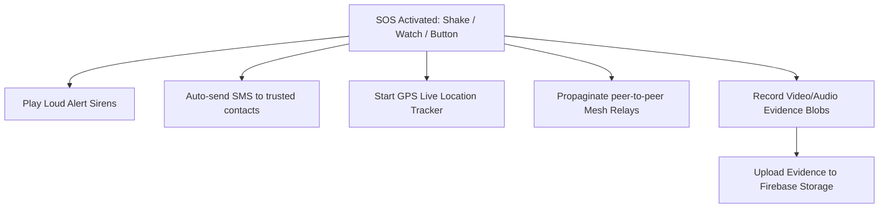

### 5. Mesh Network SOS Hopping Relay Sequence
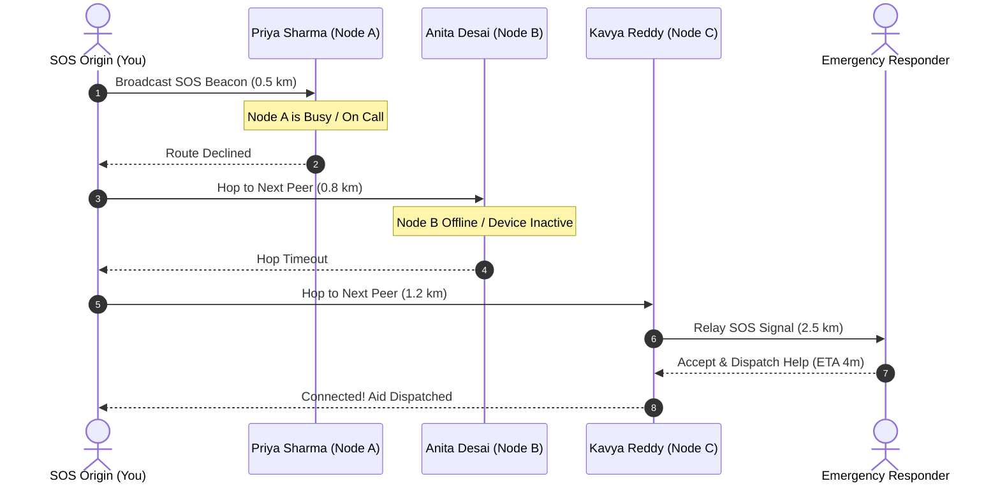

### 6. Offline Mode & Local Synchronization Flow
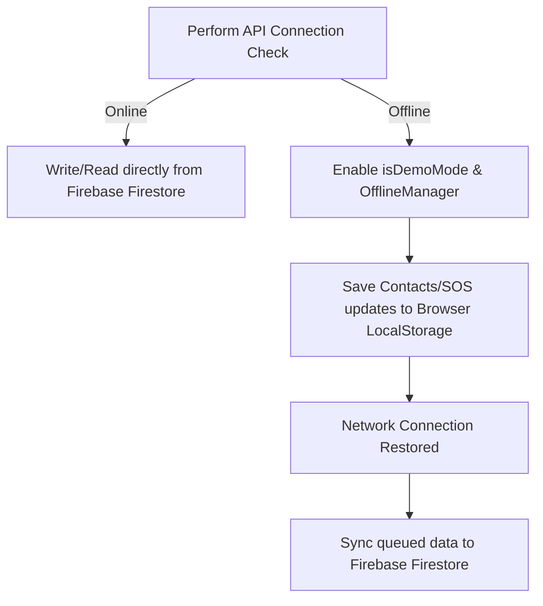

### 7. AI Safety Assistant Situation-Aware Chat Flow
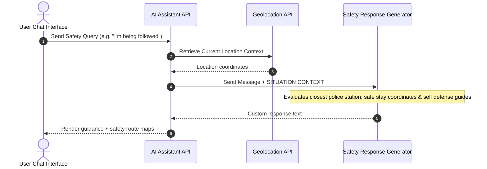

### 8. Device Shake Detection SOS Activation Logic
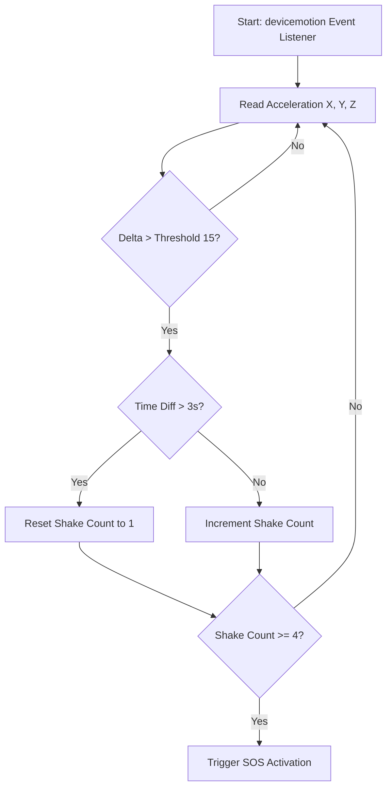

### 9. Evidence Recording Streams Capture Flow
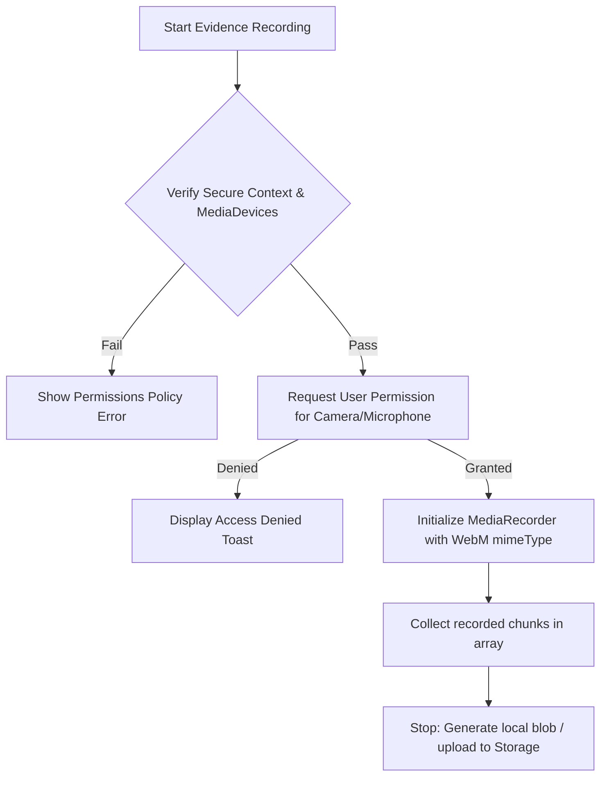

### 10. Emergency Helpline Dialer Routing Flow
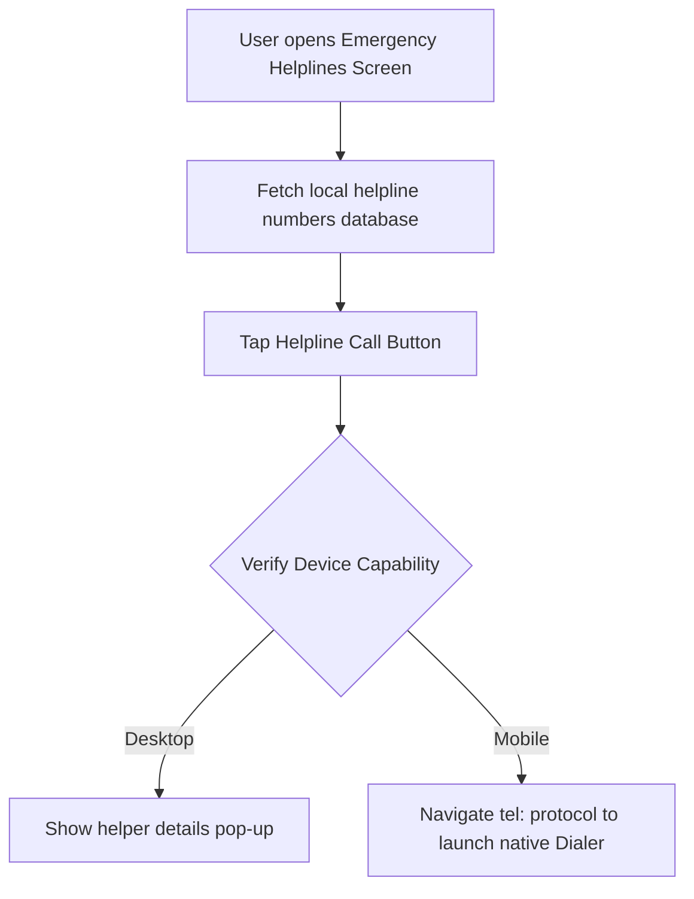

### 11. Helper Response & Direct Dispatch Flow
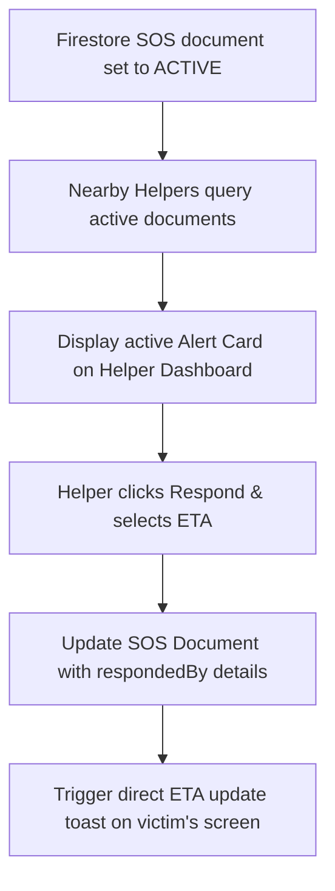

---

## Proposed Changes

The following components and files have been modified or added:

### Package Configuration & Tooling
---
#### [MODIFY] [package.json](file:///c:/Users/ASUS/Downloads/Women%20Safety%20Application/package.json)
- Cleaned up malformed versioned duplicate keys in `dependencies`.
- Removed unsupported `@jsr/supabase__supabase-js` package reference.
- Added `leaflet` and dev dependency `@types/leaflet`.
- Added `firebase` SDK to project dependencies.

#### [MODIFY] [vite.config.ts](file:///c:/Users/ASUS/Downloads/Women%20Safety%20Application/vite.config.ts)
- Configured custom regex-based resolve aliases to strip `@version` suffixes (e.g. `@radix-ui/react-label@2.1.2` -> `@radix-ui/react-label`) to resolve Figma export issues.

### Authentication & Signup Flow
---
#### [MODIFY] [LoginScreen.tsx](file:///c:/Users/ASUS/Downloads/Women%20Safety%20Application/src/app/components/LoginScreen.tsx)
- Removed `OTPVerification` modal step.
- Updated `handleSignup` to directly write user info to `localStorage` and trigger `onComplete()`.
- Set default login tab to **Email**.
- Cleaned up security notes to describe instant secure sign-up without OTP validation code.

### Mapping & Navigation (Leaflet Integration)
---
#### [MODIFY] [main.tsx](file:///c:/Users/ASUS/Downloads/Women%20Safety%20Application/src/main.tsx)
- Imported `leaflet/dist/leaflet.css` globally.

#### [MODIFY] [RoutePlanning.tsx](file:///c:/Users/ASUS/Downloads/Women%20Safety%20Application/src/app/components/RoutePlanning.tsx)
- Replaced the external Google Maps redirection with an embedded, interactive Leaflet Map.
- Plotted starting point (user's location), destination point, route path, police stations, and hospitals along the route with custom HTML/CSS divIcons.

#### [MODIFY] [NearbyHelpersMap.tsx](file:///c:/Users/ASUS/Downloads/Women%20Safety%20Application/src/app/components/NearbyHelpersMap.tsx)
- Replaced the mock CSS grid map with a real Leaflet instance displaying active helpers relative to the user's live position.

### Backend & Cloud Storage (Firebase Integration)
---
#### [NEW] [firebase.ts](file:///c:/Users/ASUS/Downloads/Women%20Safety%20Application/src/app/utils/firebase.ts)
- Initialized Firebase client SDK (Auth, Firestore, Storage) pointing to project `women-safety-application-96a91`.
- Enabled configuration using standard Vite environment variables.

#### [MODIFY] [api.ts](file:///c:/Users/ASUS/Downloads/Women%20Safety%20Application/src/app/utils/api.ts)
- Integrated Firestore queries into `contactsAPI` and `sosAPI`.
- Integrated Firebase Storage file upload into `evidenceAPI` to upload recording files.
- Provided fallback handlers to local mock variables when Firebase environment keys are inactive.

### Mesh Network SOS Relay
---
#### [NEW] [MeshNetworkHops.tsx](file:///c:/Users/ASUS/Downloads/Women%20Safety%20Application/src/app/components/MeshNetworkHops.tsx)
- Built a visual timeline demonstrating peer-to-peer hopping:
  - Relays through adjacent nodes.
  - Handles busy/inactive node cases by propagating further.
  - Finalizes when an available responder accepts the call.

#### [MODIFY] [App.tsx](file:///c:/Users/ASUS/Downloads/Women%20Safety%20Application/src/app/App.tsx)
- Added import for `MeshNetworkHops`.
- Arranged active SOS section into a 3-column dashboard consisting of Network Status ladder, Mesh Network Hops visualizer, and Nearby Helpers Leaflet map.

## Verification Plan

### Automated Tests
- Verify successful Vite compiler output: `npm run dev` starting successfully without module resolution errors.

### Manual Verification
1. Launch [http://localhost:5175/](http://localhost:5175/).
2. Submit the Signup form using the Email tab (observe instant login bypass without OTP screen).
3. Open **Plan Safe Route**, type a destination, and confirm that the Leaflet map displays the plotted route correctly.
4. Click **Trigger SOS** and verify that:
   - The 3-column dashboard is rendered.
   - The **Mesh Network Propagation** visualizer plays through the relay hops.
   - The **Nearby Helpers** map plots current positions on a Leaflet map.
