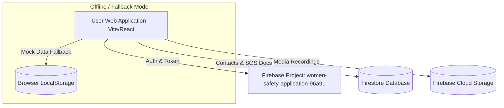
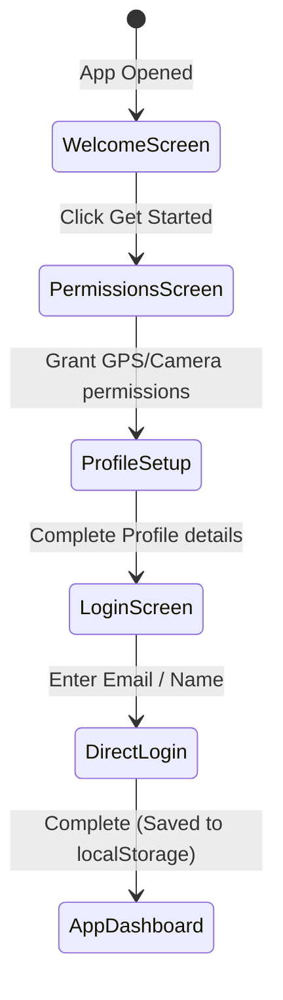
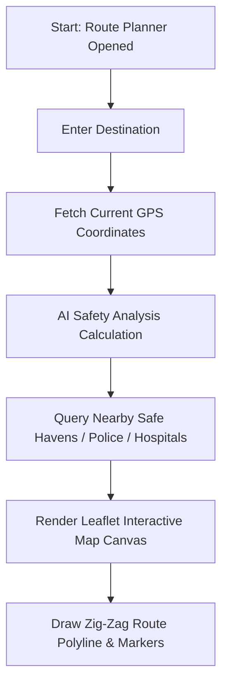
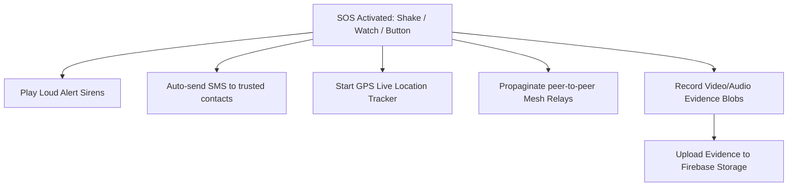
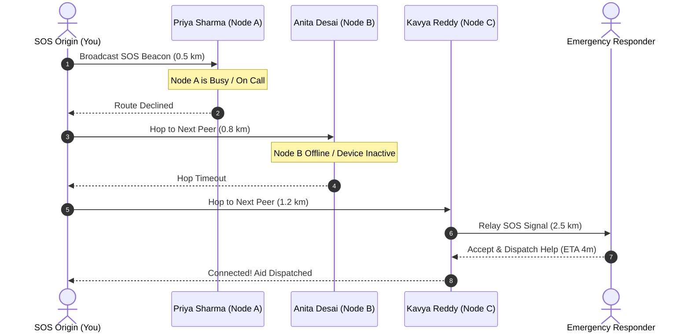

# RakshaNet: Women Safety Application

RakshaNet is a comprehensive, premium-designed web application focused on women's safety. It combines real-time P2P mesh network relays, AI-powered situational analysis, local Leaflet mapping, evidence logging, and offline synchronization powered by a Firebase backend.

---

## Table of Contents
1. [Key Features](#key-features)
2. [System Architecture Diagrams](#system-architecture-diagrams)
3. [Technology Stack](#technology-stack)
4. [File Structure](#file-structure)
5. [Getting Started & Installation](#getting-started--installation)
6. [Firebase Environment Configuration](#firebase-environment-configuration)
7. [Running the Application](#running-the-application)

---

## Key Features

- **Instant Authentication & Onboarding**: Simplified, secure signup by Email or Phone (bypassing slow OTP gates for rapid deployment).
- **Embedded Leaflet Navigation**: Displays real-time safe route lines, nearby police stations, hospitals, and safe stays directly on an interactive map.
- **Dynamic P2P Mesh Hopping Relay**: Simulates hops to adjacent peer devices when cellular signals fail, automatically bypassing busy nodes until aid is secured.
- **Situation-Aware AI Safety Assistant**: AI chat helper that leverages location context and alerts to deliver self-defense walkthroughs and route safety metrics.
- **Shake Detection Activation**: Background accelerometer listener triggers emergency SOS when the device is shaken 4 times consecutively.
- **Evidence Recording**: Captures secure microphone and camera feeds as WebM blobs, saving them locally or uploading directly to **Firebase Cloud Storage**.
- **Robust Offline Cache & Sync**: Automatically switches to local browser storage cache (`isDemoMode`) when networks are down, syncing data to Firestore upon reconnection.

---

## System Architecture Diagrams

### 1. Data and Storage Architecture


### 2. User Onboarding Flow


### 3. Safe Route Planning & Navigation Flow


### 4. SOS Emergency Trigger Flow


### 5. Mesh Network Hopping Relay Sequence


---

## Technology Stack

- **Frontend**: React (TypeScript), Tailwind CSS, Lucide Icons, Radix UI Components.
- **Build Tool**: Vite (configured with custom resolvers to strip duplicate Figma assets).
- **Maps API**: Leaflet JS, OpenStreetMap.
- **Database & Backend**: Firebase Firestore, Firebase Authentication.
- **Cloud Storage**: Firebase Cloud Storage.

---

## File Structure

```
├── package.json               # Dependencies and scripts configuration
├── vite.config.ts             # Vite build options & resolve aliases
├── src/
│   ├── main.tsx               # Global entrypoint (imports Leaflet styles)
│   ├── styles/
│   │   └── index.css          # Core CSS stylesheet
│   └── app/
│       ├── App.tsx            # Main application layout and state manager
│       ├── components/        # UI Component files
│       │   ├── NearbyHelpersMap.tsx   # Helper map rendering
│       │   ├── RoutePlanning.tsx      # Safe route finder map
│       │   ├── MeshNetworkHops.tsx    # SOS hopping timeline visualizer
│       │   └── LoginScreen.tsx        # Login & Signup handler
│       └── utils/             # Utilities and APIs
│           ├── firebase.ts    # Firebase client initialization
│           ├── api.ts         # Backend interface adapter
│           └── location.ts    # GPS tracker and browser geolocation
```

---

## Getting Started & Installation

### Prerequisites
Make sure you have **Node.js** (v18 or higher) installed on your system.

### Steps
1. **Clone or unzip** the project files into a folder of your choice.
2. Navigate into the project folder using your terminal:
   ```bash
   cd "Women Safety Application"
   ```
3. **Install the dependencies**:
   ```bash
   npm install
   ```

---

## Firebase Environment Configuration

The application is pre-configured to point to project `women-safety-application-96a91`. To connect your own live project database and storage bucket, create a `.env` file in the root directory:

```env
VITE_FIREBASE_API_KEY=your-actual-api-key
VITE_FIREBASE_APP_ID=your-actual-app-id
```

If these keys are left empty, the application will fallback to the **Demo Mode** cache automatically.

---

## Running the Application

### Start Development Server
Run the local Vite server:
```bash
npm run dev
```
Once started, open the local URL in your browser:
👉 **[http://localhost:5175/](http://localhost:5175/)**

### Build for Production
To build static bundles optimized for hosting:
```bash
npm run build
```